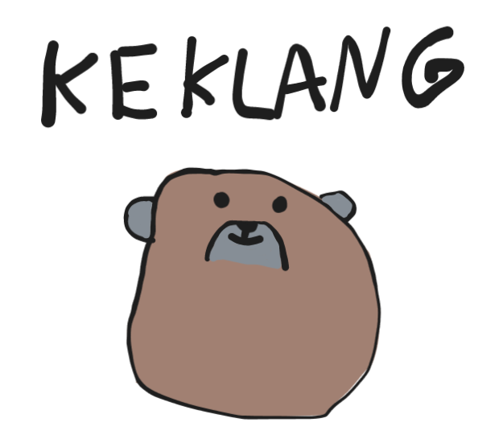

> If you don't enjoy kek-lang, go ECMA your mom!

Kek is a programming language that is designed for 
fast, reliable, scalable, maintainable, secure, beautiful, simple,
marvellous and divine software.

It will replace JavaScript and Java and scripting and all 
other compiled languages. Obviously.

It transpiles to php, js and at some point in the future c.

It is very static. 

It is very wow.

## Main Features
- very-very static
- scope-based compiler rules
- assignment-conditionals
- local & const type modifiers
- traits
- struct and methods
- not a bunch of shit-features

## Zen of KEK

- Every well-intentioned feature will be abused, so have few of them
- Don't add a feature to the language if it can be a function call.
- Don't add a feature to the language if it can be a trait.
- Don't add a feature to the language if it can be just type.
- Don't add a feature to the language if it is feature is requested by bozos.
- Especially if you are the bozo.
- If having lots of comments is retarded - we love to be retarded. Comment your fucking code you fucking fucker!
- Static analysis is king, therefore less dynamic features are king.
- Set Your datastructures in perfect order before you criticize the language.
- Local is nice.
- Do the 20 for the 80.
- "Everything is a ..." is the root of all evil and leads to communism.
- Think long about naming stuff.
- Explicit is better than implicit.
- Don't abstract too early. There is a simpler concrete solution, you are 
  just too dumb to see it quiet yet.

## Project Goal

This language is designed to allow randoms to write code to run on my 
server, but since I like this language, I will also make it work for 
game development.

## Tooling

## Not to add list
- inheritance
- try-catch-exceptions
- extensive macro-system
- dynamic typing

## Not decided yet
- operator overloading
- function overloading
- having a build-system built in
- how packages work (probably just git-repos)
- arrow vs "auto" as type inference operator
- are imports a keyword or a function, how is the syntax?

## Future-Features
- Format-Strings
- having a simple preprocessor (compile-if, line, file info, debug mode, assert, "test"-feature of zig)
- having rule-sets defined at comptime
- working (simple) generics
- doc comments
- nested comments

## Special Thanks to:
- Thomas485